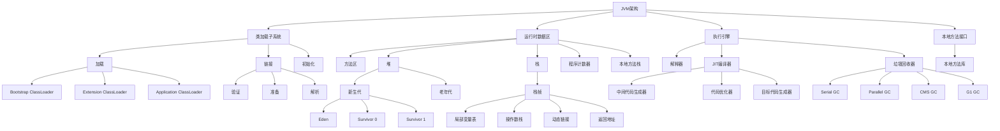

我将使用两种方式来展示JVM的主要架构：目录结构和Mermaid图。

1. **目录结构形式**：
```
JVM架构
├── 类加载子系统 (Class Loading Subsystem)
│   ├── 加载 (Loading)
│   │   ├── Bootstrap ClassLoader
│   │   ├── Extension ClassLoader
│   │   └── Application ClassLoader
│   ├── 链接 (Linking)
│   │   ├── 验证 (Verification)
│   │   ├── 准备 (Preparation)
│   │   └── 解析 (Resolution)
│   └── 初始化 (Initialization)
│
├── 运行时数据区 (Runtime Data Areas)
│   ├── 方法区 (Method Area) - 线程共享
│   │   ├── 类信息
│   │   ├── 常量
│   │   ├── 静态变量
│   │   └── JIT编译代码
│   ├── 堆区 (Heap) - 线程共享
│   │   ├── 新生代 (Young Generation)
│   │   │   ├── Eden区
│   │   │   ├── Survivor 0
│   │   │   └── Survivor 1
│   │   └── 老年代 (Old Generation)
│   ├── 栈区 (Stack) - 线程私有
│   │   └── 栈帧 (Stack Frame)
│   │       ├── 局部变量表
│   │       ├── 操作数栈
│   │       ├── 动态链接
│   │       └── 返回地址
│   ├── 程序计数器 (PC Register) - 线程私有
│   └── 本地方法栈 (Native Method Stack) - 线程私有
│
├── 执行引擎 (Execution Engine)
│   ├── 解释器 (Interpreter)
│   ├── JIT编译器 (JIT Compiler)
│   │   ├── 中间代码生成器
│   │   ├── 代码优化器
│   │   └── 目标代码生成器
│   └── 垃圾回收器 (Garbage Collector)
│       ├── Serial GC
│       ├── Parallel GC
│       ├── CMS GC
│       └── G1 GC
│
└── 本地方法接口 (Native Method Interface)
    └── 本地方法库 (Native Method Libraries)
```

2. **Mermaid图形式**：


3. **主要组件之间的交互流程**：

1. **类的生命周期**：
   - 源代码(.java) -> 字节码(.class) -> 类加载 -> 链接 -> 初始化 -> 使用 -> 卸载

2. **方法调用流程**：
   - 代码定位 -> 常量池查找 -> 方法区获取信息 -> 创建栈帧 -> 执行字节码

3. **内存管理流程**：
   - 对象创建 -> 新生代分配 -> 垃圾回收 -> 对象晋升 -> 老年代回收

4. **代码执行优化**：
   - 解释执行 -> 热点检测 -> JIT编译 -> 本地代码执行

这个架构展示了JVM的四个主要组件：
1. **类加载子系统**：负责加载、链接和初始化类
2. **运行时数据区**：管理JVM的内存结构
3. **执行引擎**：负责执行字节码和优化
4. **本地方法接口**：处理与本地代码的交互

每个组件都有其特定的职责，它们协同工作确保Java程序能够正确、高效地运行。这种模块化的设计使得JVM能够在不同平台上提供一致的执行环境，同时也便于优化和维护。